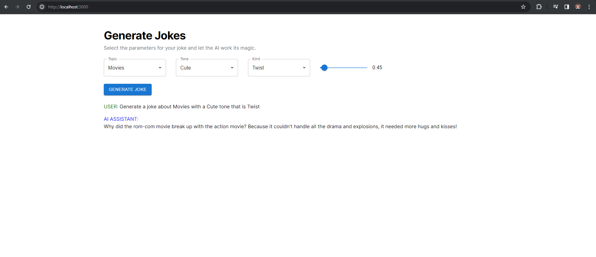

## AI Bootcamp Weekend Project #2

#### Interface:


#### Getting started: 

First, install dependencies:

```bash
npm install
# or
yarn
```

Secondly, run the development server:

```bash
npm run dev
# or
yarn dev
# or
pnpm dev
```